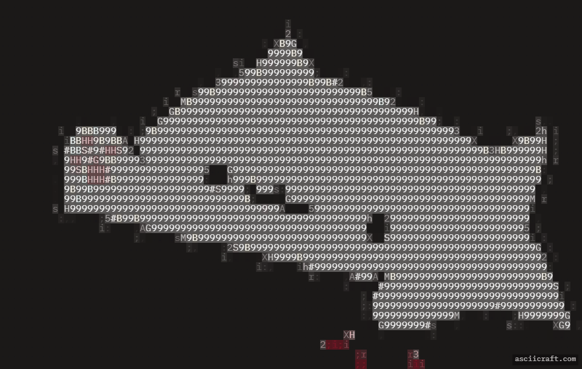

#  Hey, I'm **Rahul Koranga** 

### 🚀 AI Engineer • Full Stack • IoT • NLP

  
  

## ⚡ About

* 🏪 Building smart inventory for local kiranas with voice-based stock management and automation
* 🌄 Built Kumaoni local-language chatbot using RAG, removing separate model training costs
* 🔥 Working on invisible fire detection with advanced vision pipelines
* ♻️ Built Eco-Connect, an AI-powered waste management platform with smart classification

## 🛠️ Stack

  
  
  
  
  

## 🚀 Highlight Builds

* 🌄 **Kumaoni Translator**
* 🎟️ **AI Ticket Reservation System**
* 🔥 **Real-Time Fire Detection**
* 🌾 **Krishi Seva Smart Inventory**
* ⚙️ **OS Task Simulator**

## 📊 GitHub

  
  

## 🌐 Connect

  
  

> **Build what matters ⚡**
